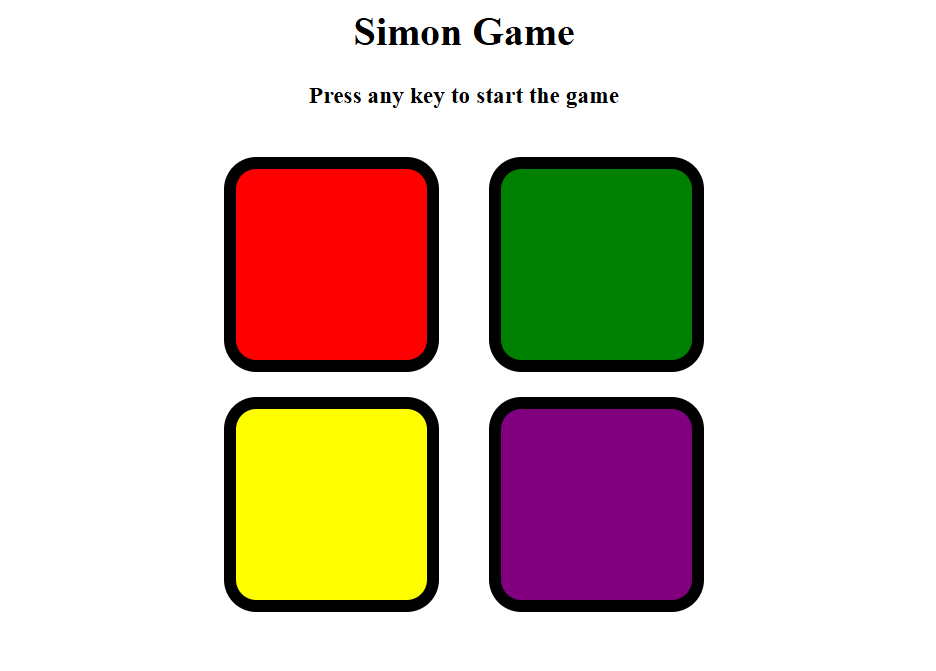
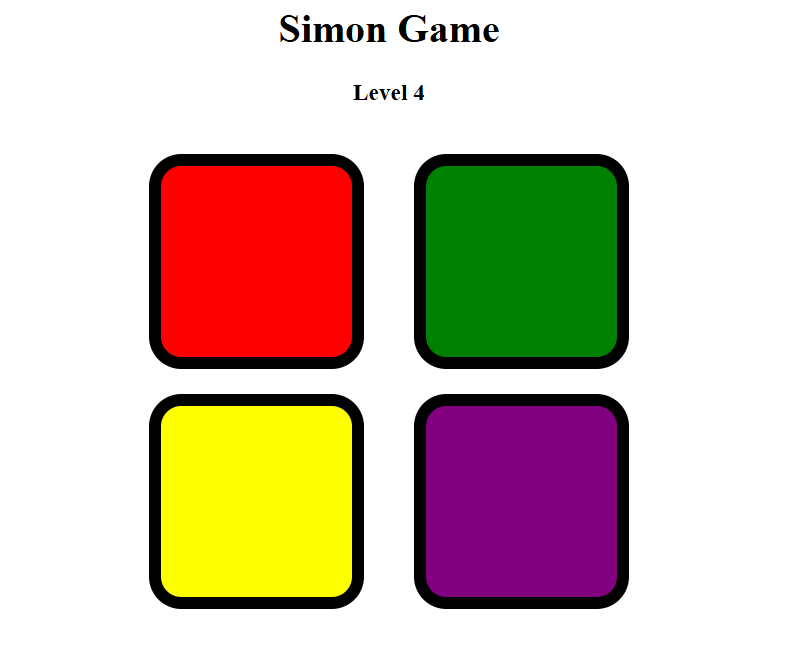
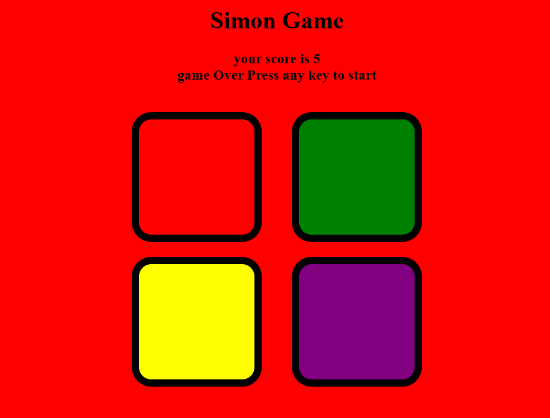

# 🎯 Simon Says Game  

A fun and interactive memory challenge built using **HTML**, **CSS**, and **JavaScript**.  
Test your brain by repeating the sequence of colors — each round gets harder!  

---

## 🕹 How to Play  
1️⃣ Press any key to **start the game**.  
2️⃣ Watch the **sequence of colors** that lights up.  
3️⃣ Click the buttons in **the exact same order**.  
4️⃣ With every correct round, the sequence gets **longer & trickier**.  

---

## 🚀 Play Now  
👉 **[Click Here to Play](https://DurgaPrasadKattunga.github.io/simon-says-game/)**  

*(Opens directly in your browser — no installation needed!)*  

---

## 📸 Screenshot  
### 🟢 Start Screen

### 🎯 During Play

### 🔴 Game Over
 

---

## 💻 Built With  
- 🎨 **HTML** – Structure  
- 🎨 **CSS** – Styling  
- ⚡ **JavaScript** – Game Logic  

---

## 📬 Contact  
💌 Created by **[Durga Prasad Kattunga](https://github.com/DurgaPrasadKattunga)**  
If you enjoyed it, don’t forget to ⭐ star the repo!  

---
